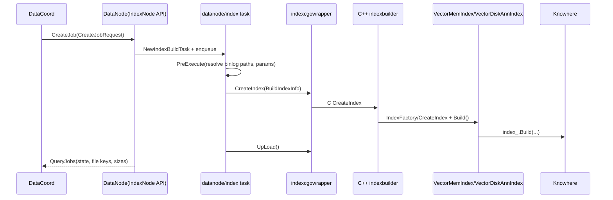
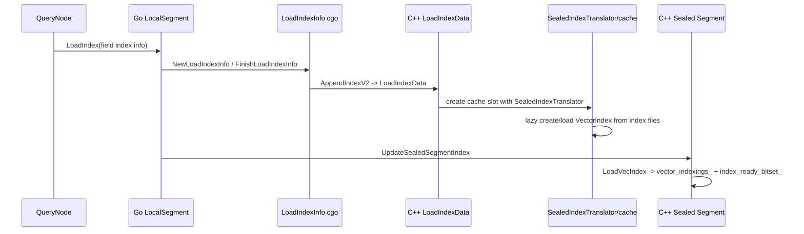
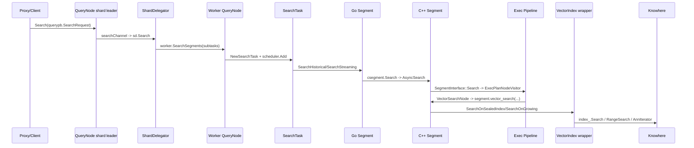

# Milvus Index Build / Load / Search Call Chain

Date: 2026-05-10

Scope: 梳理索引 build 和 search 流程，重点标出 QueryNode、Segment、Knowhere 之间的模块和接口边界。

## 总览

Milvus 的向量索引链路可以拆成三条相关但分离的路径：

1. Build: DataCoord 调度，DataNode 以 IndexNode API 角色执行索引构建，最终进入 C++ indexbuilder 和 Knowhere。
2. Load: QueryNode 加载 build 产物，把 index files 变成 sealed Segment 上可搜索的索引对象。
3. Search: QueryNode 接收搜索请求，经 ShardDelegator / Worker / Segment 进入 segcore，最后由 C++ index wrapper 调 Knowhere。

关键边界：

- QueryNode Go 层不直接调用 Knowhere。
- Go 层 QueryNode 通过 `segments.Segment.Search` 进入 Segment 抽象。
- Segment 的 Go/C++ 边界在 `internal/util/segcore` cgo wrapper 和 `segcore/segment_c.cpp`。
- Knowhere 被封装在 Milvus C++ `index::VectorIndex` 实现后面，例如 `VectorMemIndex` 和 `VectorDiskAnnIndex`。
- 正常 sealed segment 场景下，QueryNode 不负责 build index；它加载 DataNode/IndexNode API 构建后持久化的 index files。

## Build 流程



### Build 关键调用点

- `internal/datacoord/task_index.go`
  - `indexBuildTask.CreateTaskOnWorker`: DataCoord 选择 worker 并调用 `cluster.CreateIndex(nodeID, req)`。
  - `prepareJobRequest`: 组装 `workerpb.CreateJobRequest`，包括 segment、field、index params、binlogs、storage config、index file prefix。
  - `QueryTaskOnWorker`: 查询 worker 上的 build 状态，完成后更新 DataCoord 元数据。

- `internal/datanode/index_services.go`
  - `CreateJob`: DataNode 作为 IndexNode API 的实现入口，接收 build job。
  - `QueryJobs`: 返回任务状态和 index file keys。
  - `DropJobs`: 删除/取消任务。

- `internal/datanode/index/task_index.go`
  - `PreExecute`: 解析 DataIds 到 binlog paths，合并 type params / index params，补齐 dim 和 field meta。
  - `Execute`: 组装 `indexcgopb.BuildIndexInfo`，调用 `indexcgowrapper.CreateIndex`。
  - `PostExecute`: 调 `UpLoad` 上传索引文件，记录 file keys、serialized size、mem size、current versions。

- `internal/util/indexcgowrapper/index.go`
  - `CreateIndex`: Go -> C++ build 边界，marshal `BuildIndexInfo` 后调用 C `CreateIndex`。
  - `CodecIndex`: Go 侧持有的 C++ index handle 接口，包含 `Build`、`Serialize`、`Load`、`Delete`、`CleanLocalData`、`UpLoad`。

- `internal/core/src/indexbuilder/index_c.cpp`
  - C `CreateIndex`: 解析 build proto，创建 chunk manager / file manager context，调用 `indexbuilder::IndexFactory::CreateIndex`，然后 `index->Build()`。

- `internal/core/src/indexbuilder/IndexFactory.h`
  - scalar field 分发到 scalar index。
  - vector field 分发到 `VecIndexCreator`。

- `internal/core/src/indexbuilder/VecIndexCreator.cpp`
  - 创建 Milvus C++ vector index wrapper。
  - `Build()` 最终调用底层 `index_->Build(config_)` 或 `BuildWithDataset`。

- `internal/core/src/index/VectorMemIndex.cpp`
  - `Build`: 从 storage 读原始向量数据，组装 dataset。
  - `BuildWithDataset`: 调 `index_.Build(dataset, index_config, use_knowhere_build_pool_)`，这里的 `index_` 是 Knowhere index。

- `internal/core/src/index/VectorDiskIndex.cpp`
  - DiskANN build 会把 raw data / offsets 写到本地路径，设置 DiskANN build config，再调用 `index_.Build({}, build_config)`。

## Load Index 流程

Build 产物通过 index files 和元数据进入 QueryNode。加载完成后，sealed Segment 上的 `vector_indexings_` 和 `index_ready_bitset_` 决定 search 是否走索引路径。



### Load 关键调用点

- `internal/querynodev2/segments/segment_loader.go`
  - `Loader` 接口包含 `Load`、`LoadIndex`、`LoadJSONIndex`、`ReopenSegments`。

- `internal/querynodev2/segments/segment.go`
  - `LocalSegment.LoadIndex`: Go Segment 的 index load 入口。
  - `GetCLoadInfoWithFunc`: 清理和组装 load params、index files、buildID、version、numRows、size、field info。
  - `UpdateIndexInfo`: 调 C `UpdateSealedSegmentIndex`，并在 Go 侧记录 field indexes。

- `internal/querynodev2/segments/load_index_info.go`
  - `newLoadIndexInfo`: 创建 C load index info。
  - `appendLoadIndexInfo`: marshal `cgopb.LoadIndexInfo` 并传给 C++。
  - `loadIndex`: 调 C `AppendIndexV2`。

- `internal/core/src/segcore/load_index_c.cpp`
  - `FinishLoadIndexInfo`: C++ 解析 load index proto。
  - `AppendIndexV2`: 调 `LoadIndexData`。

- `internal/core/src/segcore/Utils.cpp`
  - `LoadIndexData`: 解析 index files / config，创建 `SealedIndexTranslator`，放入 cache layer。

- `internal/core/src/segcore/storagev1translator/SealedIndexTranslator.cpp`
  - `get_cells`: 真正创建 index wrapper，并调用 `index->Load(ctx_, config_)`。

- `internal/core/src/segcore/ChunkedSegmentSealedImpl.cpp`
  - `LoadIndex`: sealed segment 加载 index 的 C++ 入口。
  - `LoadVecIndex`: 把 cache slot 记录到 `vector_indexings_`，设置 `index_ready_bitset_`。

## Search 流程



### Search 关键调用点

- `internal/querynodev2/services.go`
  - `QueryNode.Search`: 校验 collection loaded、channel 数量，然后调用 `searchChannel`。
  - `SearchSegments`: worker/local segment search 入口，创建 `SearchTask`，交给 scheduler 执行。

- `internal/querynodev2/handlers.go`
  - `searchChannel`: 根据 channel 找 shard delegator，调用 `sd.Search(ctx, req)`，最后用 `segments.ReduceSearchOnQueryNode` 汇总结果。

- `internal/querynodev2/delegator/delegator.go`
  - `Search`: 等待 tsafe，进入 delegator search 主流程。
  - `search`: segment pruning、BM25/MinHash 检查、two-stage search、search params 优化。
  - `executeSearchSubTasks`: 组织 subtask，调用 worker 的 `SearchSegments`。

- `internal/querynodev2/tasks/search_task.go`
  - `SearchTask.Execute`: 创建 `segcore.NewSearchRequest`，根据 segment 类型走 `SearchHistorical` 或 `SearchStreaming`。
  - 普通 search 结束后调用 `segcore.ReduceSearchResultsAndFillData`。
  - filter-only two-stage search 只执行 scalar filter 并返回 valid counts，不进入 vector Knowhere search。

- `internal/querynodev2/segments/segment_interface.go`
  - `Segment.Search(ctx, searchReq)`: QueryNode Go 层面向 Segment 的稳定接口。

- `internal/querynodev2/segments/search.go`
  - `SearchHistorical`: sealed segment 搜索入口。
  - `SearchStreaming`: growing segment 搜索入口。
  - `searchSegments`: 遍历 segments，调用每个 `s.Search(ctx, searchReq)`。

- `internal/querynodev2/segments/segment.go`
  - `LocalSegment.Search`: pin C segment，检查是否存在 index，然后调用 `s.csegment.Search(ctx, searchReq)`。

- `internal/util/segcore/plan.go`
  - `NewSearchRequest`: 创建 C++ search plan，解析 placeholder group，记录 search field、metric type、mvcc、filterOnly 等。

- `internal/util/segcore/segment.go`
  - `cSegmentImpl.Search`: Go -> C++ search 边界，调用 C `AsyncSearch`。

- `internal/core/src/segcore/segment_c.cpp`
  - `AsyncSearch`: 把 C handle 转成 `SegmentInterface*`、`query::Plan*`、`PlaceholderGroup*`，在线程池里调用 `segment->Search(...)`。

- `internal/core/src/segcore/SegmentInterface.cpp`
  - `SegmentInternalInterface::Search`: lock segment，检查 search 条件，构造 `query::ExecPlanNodeVisitor` 执行 plan。

- `internal/core/src/query/ExecPlanNodeVisitor.cpp`
  - `visit(VectorPlanNode&)`: 普通 vector search 会构造 `QueryContext` 和执行计划；filter-only path 只计算 valid row count。

- `internal/core/src/exec/operator/VectorSearchNode.cpp`
  - `PhyVectorSearchNode::GetOutput`: 构造 bitset，取 query blob/offsets，然后调用 `segment_->vector_search(...)`。

## Segment 到 Knowhere 的分支

`segment.vector_search(...)` 之后，是否进入 Knowhere 取决于 segment 类型和 index 状态。

```text
sealed + index ready
  -> ChunkedSegmentSealedImpl::vector_search
  -> query::SearchOnSealedIndex
  -> index::VectorIndex::Query
  -> VectorMemIndex/VectorDiskAnnIndex
  -> Knowhere Search/RangeSearch/AnnIterator

sealed + no index
  -> ChunkedSegmentSealedImpl::vector_search
  -> query::SearchOnSealedColumn
  -> BruteForceSearch

growing + small index synced
  -> SegmentGrowingImpl::vector_search
  -> query::SearchOnGrowing
  -> query::SearchOnIndex
  -> index::VectorIndex::Query
  -> Knowhere

growing + no small index
  -> SegmentGrowingImpl::vector_search
  -> query::SearchOnGrowing
  -> chunk brute force
```

### C++ search 分支代码

- `internal/core/src/segcore/ChunkedSegmentSealedImpl.cpp`
  - `vector_search`: sealed segment search 分支。
  - index ready 时走 `query::SearchOnSealedIndex`。
  - 没有 index 时走 `query::SearchOnSealedColumn`。

- `internal/core/src/segcore/SegmentGrowingImpl.cpp`
  - `vector_search`: growing segment search 入口，调用 `query::SearchOnGrowing`。

- `internal/core/src/query/SearchOnSealed.cpp`
  - `SearchOnSealedIndex`: 获取 sealed indexing record，pin cache cell，拿到 `index::VectorIndex*`，调用 `vec_index->Query(...)`。
  - `SearchOnSealedColumn`: 对 sealed column chunks 做 brute-force search。

- `internal/core/src/query/SearchOnGrowing.cpp`
  - 如果 growing small index 已 synced，则通过 `SearchOnIndex` 搜索 index。
  - 否则对 growing chunks 做 brute-force search。

- `internal/core/src/query/SearchOnIndex.cpp`
  - 通用 index search wrapper，创建 Knowhere dataset，处理 offset mapping / iterator，然后调用 `indexing.Query(...)`。

- `internal/core/src/index/VectorIndex.h`
  - Milvus C++ 侧对 Knowhere 的抽象接口，定义 `Query` 等方法。

- `internal/core/src/index/VectorMemIndex.cpp`
  - memory index wrapper。
  - `Query`: 组装 Knowhere search config，调用 `index_.Search(...)` 或 `index_.RangeSearch(...)`。

- `internal/core/src/index/VectorDiskIndex.cpp`
  - DiskANN wrapper。
  - `Query`: 组装 DiskANN list / beamwidth / prefix path 等参数，调用 Knowhere disk index 的 search/range search。

## 模块接口边界表

| 模块 | 主要责任 | 对外/跨层接口 | 下游 |
| --- | --- | --- | --- |
| DataCoord | index build 调度和元数据状态机 | `CreateTaskOnWorker`, `prepareJobRequest`, `QueryTaskOnWorker` | DataNode IndexNode API |
| DataNode(IndexNode API) | 接收和执行 index build job | `CreateJob`, `QueryJobs`, `DropJobs` | datanode index task |
| datanode index task | build task 生命周期 | `PreExecute`, `Execute`, `PostExecute` | indexcgowrapper |
| indexcgowrapper | Go -> C++ build handle | `CreateIndex`, `CodecIndex.UpLoad` | C++ indexbuilder |
| C++ indexbuilder | 创建 scalar/vector index wrapper | C `CreateIndex`, `IndexFactory`, `VecIndexCreator` | Milvus C++ index wrapper |
| Milvus C++ VectorIndex | 封装 Knowhere index | `Build`, `Load`, `Query`, `Serialize` | Knowhere |
| QueryNode service | search RPC 入口和 channel 路由 | `Search`, `searchChannel` | ShardDelegator |
| ShardDelegator | shard 内 segment pruning 和 worker 分发 | `Search`, `executeSearchSubTasks` | Worker QueryNode |
| Worker/SearchTask | 本地 segment search 调度 | `SearchSegments`, `SearchTask.Execute` | Go Segment |
| Go Segment | QueryNode 本地 segment 生命周期/search/load 抽象 | `Segment.Search`, `LoadIndex`, `UpdateIndexInfo` | segcore cgo |
| segcore C++ Segment | 执行 query plan 和 segment.vector_search | `AsyncSearch`, `SegmentInterface::Search`, `vector_search` | query/search operators |
| query operators | 构造 bitset、执行 vector search operator | `ExecPlanNodeVisitor`, `VectorSearchNode` | C++ Segment search functions |
| Knowhere | ANN build/search 实现 | `Build`, `Search`, `RangeSearch`, `AnnIterator`, `Deserialize` | index-specific engine |

## QueryNode / Segment / Knowhere 的关系

从调用方向看：

```text
QueryNode
  -> ShardDelegator
  -> Worker/SearchTask
  -> Go Segment interface
  -> segcore cgo
  -> C++ SegmentInterface
  -> query execution / vector_search
  -> Milvus C++ VectorIndex wrapper
  -> Knowhere
```

从职责边界看：

- QueryNode 负责 request routing、shard delegation、segment selection、task scheduling、result reduce。
- Segment 负责把 loaded data/index 暴露为统一 search/load 接口，并屏蔽 sealed/growing 差异。
- segcore 负责执行 plan、表达式过滤、bitset、sealed/growing search 分支。
- Milvus C++ `VectorIndex` wrapper 负责把 Milvus 的数据结构、参数、offset mapping 转成 Knowhere dataset/config。
- Knowhere 负责实际 ANN index 的 build/search/range search/iterator。

## 读源码时的建议路径

如果要继续深入，建议按下面顺序读：

1. Search 主干：`QueryNode.Search` -> `searchChannel` -> `ShardDelegator.Search` -> `SearchSegments` -> `SearchTask.Execute`。
2. Segment 边界：`segments.Segment.Search` -> `LocalSegment.Search` -> `cSegmentImpl.Search` -> `AsyncSearch`。
3. C++ 执行：`SegmentInterface::Search` -> `ExecPlanNodeVisitor::visit(VectorPlanNode&)` -> `VectorSearchNode::GetOutput`。
4. index 分支：`ChunkedSegmentSealedImpl::vector_search` -> `SearchOnSealedIndex` -> `VectorIndex::Query` -> `VectorMemIndex/VectorDiskAnnIndex::Query`。
5. Build/load 闭环：`DataCoord CreateTaskOnWorker` -> `DataNode CreateJob` -> `indexcgowrapper.CreateIndex` -> `VectorIndex::Build` -> `QueryNode LoadIndex` -> `SealedIndexTranslator`。

## 当前阅读结论

- Build 和 search 不是同一条同步调用链，中间通过 index files、index meta、segment load meta 解耦。
- QueryNode 看到的是 Segment 和 loaded index 信息，不关心 Knowhere 的具体 index 类型实现。
- Segment 是 QueryNode 与 segcore 的关键边界；Knowhere 是 C++ index wrapper 后面的实现细节。
- sealed segment 是否走 Knowhere，主要取决于 index 是否 ready；否则退回 column brute force。
- growing segment 可能走 small index，也可能对 growing chunks brute force。
- two-stage/filter-only search 的第一阶段可能只做 scalar filter，不触发 Knowhere vector search。

