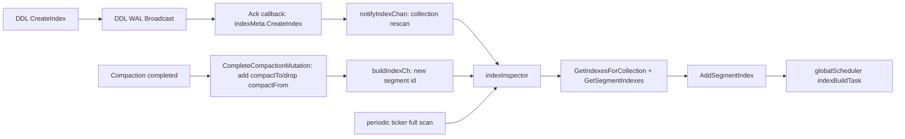

# DDL Create Index 与 Compaction 并发下的索引补齐机制

日期：2026-05-10

## 结论

Milvus 当前不是通过把 `CreateIndex` DDL 和 compaction 完全互斥来保证 segment 不漏建索引。

真正的保证来自一个最终一致的不变量：

> 对每个 live collection index，所有 eligible flushed segment 都应该存在对应的 `SegmentIndex` 记录；缺失时由 `indexInspector` 补建。

因此并发控制分成两层：

1. DDL 层保证 collection 级 index definition 有序落 meta。-> 请求不丢
2. segment/index reconciliation 层保证新 index 和新 segment 之间的差集最终被补齐。-> segment补齐

## 核心流程



## 关键代码入口

### CreateIndex DDL

- `internal/datacoord/index_service.go:128`
  - `Server.CreateIndex`
  - 负责校验请求、构造 `model.Index`、发 DDL broadcast。
- `internal/datacoord/index_service.go:315`
  - broadcast `CreateIndexMessageV2` 到 control channel 和 collection vchannels。
- `internal/datacoord/ddl_callbacks_create_index.go:26`
  - ack callback 中调用 `indexMeta.CreateIndex` 写 collection 级 index meta。
  - 写入成功后非阻塞发送 `notifyIndexChan <- collectionID`。

注意：`CreateIndex` 注释里说会记录所有 flushed segment 的 index task，但当前实现的实际路径是 DDL ack 写 index definition，然后由 `indexInspector` 扫描补齐 segment index task。

### Index Meta

- `internal/datacoord/index_meta.go:503`
  - `indexMeta.CreateIndex`
  - 使用 `fieldIndexLock.Lock()` 串行化 collection index map 的写入。
- `internal/datacoord/index_meta.go:551`
  - `indexMeta.AddSegmentIndex`
  - 持久化 segment 级 index build meta，然后更新内存结构。
- `internal/datacoord/index_meta.go:805`
  - `indexMeta.IsUnIndexedSegment`
  - 判断某个 segment 是否缺少任意 live collection index。

### Index Inspector

- `internal/datacoord/index_inspector.go:89`
  - `createIndexForSegmentLoop`
  - 一个 goroutine 中处理三类触发：
    - ticker 周期扫描所有 flushed segment。
    - `notifyIndexChan`：create index 后扫描 collection 下 flushed segment。
    - `buildIndexCh`：新 flushed segment 或 compaction result segment。
- `internal/datacoord/index_inspector.go:137`
  - `getUnIndexTaskSegments`
  - 周期兜底：遍历 flushed segment，用 `IsUnIndexedSegment` 找缺口。
- `internal/datacoord/index_inspector.go:149`
  - `createIndexesForSegment`
  - 对 segment 遍历 collection 下所有 live index，缺哪个建哪个。
- `internal/datacoord/index_inspector.go:228`
  - `createIndexForSegment`
  - 分配 buildID，写 `SegmentIndex`，入队 `indexBuildTask`。

### Compaction

- `internal/datacoord/meta.go:2216`
  - `CompleteCompactionMutation`
  - 持有 `segMu.Lock()`，完成 compactFrom/compactTo 的 segment meta mutation。
- `internal/datacoord/compaction_task_mix.go:235`
  - `saveSegmentMeta`
  - compaction result segment 落 meta 后，把新 segment id 非阻塞发送到 `buildIndexCh`。
- `internal/datacoord/go_channel_singleton.go:28`
  - `buildIndexCh` 是全局 buffered channel，容量 1024。

## 并发场景分析

### 1. CreateIndex 先完成，compaction 后提交

顺序：

1. DDL ack callback 写入 collection index definition。
2. compaction 完成，生成 compactTo segment。
3. compaction task 将 compactTo segment id 发送到 `buildIndexCh`。
4. `indexInspector` 读取该 segment，并根据已存在的 collection index 补 `SegmentIndex`。

结果：新 segment 不漏建索引。

### 2. Compaction 先提交，CreateIndex 后完成

顺序：

1. compaction 先生成 compactTo segment。
2. DDL ack callback 后写入 collection index definition。
3. callback 发送 `notifyIndexChan <- collectionID`。
4. `indexInspector` 扫描 collection 下所有 flushed segment，包括刚生成的 compactTo。

结果：已存在的新 segment 会被 create index 的 collection rescan 补上。

### 3. 通知丢失

`notifyIndexChan` 和 `buildIndexCh` 的发送都是非阻塞的：

```go
select {
case ch <- id:
default:
}
```

因此通知可能因为 channel 满而丢失。

不漏的兜底不依赖通知本身，而依赖 `indexInspector` 的 ticker：

1. 周期扫描所有 flushed segment。
2. 用 `IsUnIndexedSegment` 判断是否缺 live index。
3. 缺失则重新创建 segment index task。

所以这里是 eventually consistent，不是 synchronous guarantee。

### 4. 老 segment 正在建索引时被 compaction drop

`indexBuildTask.CreateTaskOnWorker` 会检查：

- build task meta 是否仍存在。
- segment 是否 healthy。
- collection index definition 是否仍存在。

如果 input segment 已经被 compaction drop，老 segment 的 build task 会退出，不再继续构建。

这不会导致索引漏建，因为 compactTo segment 会通过 `buildIndexCh` 或 ticker 被补建。

相关代码：`internal/datacoord/task_index.go:149`。

## Compaction 侧的额外约束

### IndexBasedCompaction

默认配置：

- `configs/milvus.yaml:683`
  - `dataCoord.compaction.indexBasedCompaction: true`
- `pkg/util/paramtable/component_param.go:5237`
  - 默认值为 `true`。

相关代码：

- `internal/datacoord/compaction_trigger.go:378`
  - compaction 生成 candidate 后会调用 `FilterInIndexedSegments`。
- `internal/datacoord/util.go:75`
  - `FilterInIndexedSegments` 过滤 indexed dataview。

默认情况下，它主要保证 vector field 的 indexed readiness。

如果 `dataCoord.dataview.forceAllIndexReady=true`，则 scalar indexes 也会参与 indexed dataview ready 判断。

### GC 约束

GC 不会在 compactTo 未 indexed 时回收 compactFrom：

- `internal/datacoord/garbage_collector.go:687`
  - `checkDroppedSegmentGC`
- `internal/datacoord/garbage_collector.go:699`
  - 对于 `A,B -> C`，如果 C 未 indexed，则不 GC A/B。

这不是建索引本身的触发机制，但它保证 compacted parent 不会过早清理，避免替换成未 indexed child 后造成性能退化或视图不稳定。

## Eligible Segment 的例外

`indexInspector` 不会对所有 segment 无条件建索引。

会跳过：

1. L0 segment。
2. 开启 sort compaction 时尚未 sorted 的普通 segment。
3. 物理 backfill 场景下，segment schema version 或字段 binlog 尚未满足 `index.MinSchemaVersion` 的 segment。

相关代码：

- `internal/datacoord/index_inspector.go:149`
  - skip L0 / unsorted。
- `internal/datacoord/index_service.go:302`
  - create index 时记录 `MinSchemaVersion`。
- `internal/datacoord/index_inspector.go:162`
  - physical backfill 下延迟建索引，避免对缺字段数据的 segment 建出错误索引。

## 读代码时的判断标准

判断这类并发是否安全，可以按这个 checklist 看：

1. 新 index definition 落 meta 后，是否会扫描已有 segment？
   - 是，`notifyIndexChan` 触发 collection rescan。
2. 新 segment 落 meta 后，是否会扫描已有 index definition？
   - 是，`buildIndexCh` 触发 segment rescan。
3. 通知丢了是否有兜底？
   - 有，ticker 周期扫描 `IsUnIndexedSegment`。
4. 旧 input segment 被 compaction drop，旧 index task 失败是否影响正确性？
   - 不影响，compactTo segment 会重新补建。
5. DataCoord 重启后未完成 index task 是否恢复？
   - `indexInspector.Start` 调用 `reloadFromMeta`，会重新 enqueue 未完成任务。

## 一句话模型

DDL create index 产生 collection 级 index definition；compaction 产生新的 flushed segment；`indexInspector` 持续把二者做差集补齐。

因此当前机制的正确性重点不是“DDL 和 compaction 谁先执行”，而是“任意一侧状态变化后，另一侧是否会被重新扫描；扫描通知丢失后，周期 reconciler 是否兜底”。

## Growing Segment 与 Small Index

这里有两个容易混淆的“small”概念：

1. DataCoord 的小 sealed segment 逻辑：
   - `dataCoord.segment.minSegmentNumRowsToEnableIndex` 默认是 `1024`。
   - sealed/flushed segment 的有效行数低于该阈值时，index build task 会直接标记 `Finished`，不会真正提交 IndexNode 构建任务。
   - 这是 DataCoord 的 segment index build 逻辑，不是 growing segment 的搜索路径。

2. SegCore 的 growing small indexing search：
   - growing segment 搜索时，`SearchOnGrowing` 会先判断 `segment.get_indexing_record().SyncDataWithIndex(fieldID)`。
   - 如果为 true，则走 `FloatSegmentIndexSearch`，使用 `IndexingRecord` 中的 `VectorMemIndex`。
   - 如果为 false，则 fallback 到 brute force search。

因此：growing segment 可能走 small index，但这是 QueryNode/SegCore 内存里的 growing index，不是持久化的 sealed segment index 文件，也不受 DataCoord 小段 fake-finish 逻辑直接控制。

关键判断点：

- growing insert/load 后会通过 `ack_responder_.AddSegment(...)` 更新 small index。
- `IndexingRecord::AppendingIndex` 只有在该字段存在 indexing 配置，且有效数据量达到 `GetBuildThreshold()` 后才会向 vector index append/build。
- 搜索时是否真的走索引，只看 `SyncDataWithIndex(fieldID)` 是否为 true；否则仍然暴力扫 growing 原始数据。

## StreamingNode 是否建索引

结论：StreamingNode 不负责 sealed/flushed segment 的持久化索引构建。

它参与的是 streaming/WAL、segment 创建/flush，以及内嵌 QueryNode/SegCore 的 growing 数据服务。StreamingNode 启动时会初始化 WAL manager、handler/manager service，并调用 `initcore.InitQueryNode` 初始化 QueryNode 的 segcore。

CreateIndex DDL 会广播到 control channel 和 collection vchannels；广播 ack 后，DataCoord 的 DDL callback 才把 collection-level index definition 写入 index meta，并通知 `indexInspector`。

之后 sealed/flushed segment 的索引构建仍由 DataCoord 创建 build task，再通过 worker cluster 发给 IndexNode 执行。

因此需要区分：

- StreamingNode/embedded QueryNode 侧：
  - growing segment 可能维护内存 small index，用于 growing search 加速。
  - 这不是持久化 index 文件，也不替代 IndexNode。
- DataCoord/IndexNode 侧：
  - collection-level index definition 落 meta 后，`indexInspector` 对 sealed/flushed segment 补 `SegmentIndex`。
  - 真实 build task 发送给 IndexNode。

补充：TEXT collection 的 streaming flush 逻辑里有特殊分支，注释说明 insert data 由 QueryNode 的 `GrowingFlushManager` 管理，而不是 StreamNode 的 write buffer；这仍然不等于 StreamingNode 执行通用 sealed segment index build。
